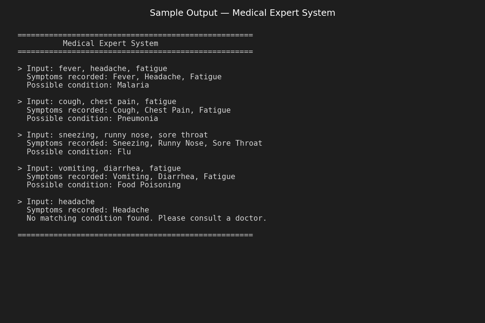
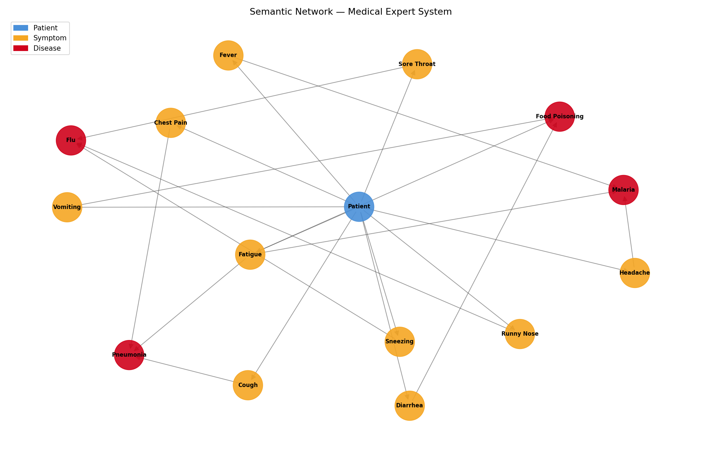

# Medical Expert System — APT 3020B Week 3 Lab

## Description
A simple rule-based expert system that identifies possible illnesses from patient symptoms using IF-THEN knowledge representation.

## Objectives
- Represent knowledge using facts and rules
- Design and implement a rule-based expert system
- Apply logical inference (forward chaining)

## Symptoms Used
Fever, Headache, Cough, Chest Pain, Sneezing, Runny Nose, Fatigue, Sore Throat, Vomiting, Diarrhea

## Diseases Detected
| Disease | Symptoms Required |
|---------|-------------------|
| Malaria | Fever + Headache + Fatigue |
| Pneumonia | Cough + Chest Pain + Fatigue |
| Flu | Sneezing + Runny Nose + Sore Throat |
| Food Poisoning | Vomiting + Diarrhea + Fatigue |

## Rules Applied
IF-THEN rules stored in `knowledge_base.json` and evaluated at runtime via forward chaining.

## Technologies Used
- Python 3.x
- JSON (knowledge base)
- NetworkX + Matplotlib (semantic network diagram)

## How to Run
```bash
cd week-3
python main.py
```

## Project Structure
```
week-3/
├── main.py                # Rule-based expert system
├── knowledge_base.json    # Facts, symptoms, diseases, rules
├── semantic_network.py    # Generates the diagram
├── semantic_network.png   # Semantic network diagram
└── README.md
```

## Group Members
| Name | Student ID |
|------|------------|
| Musyoka Philip | 672714 |

## Sample Output


## Semantic Network

